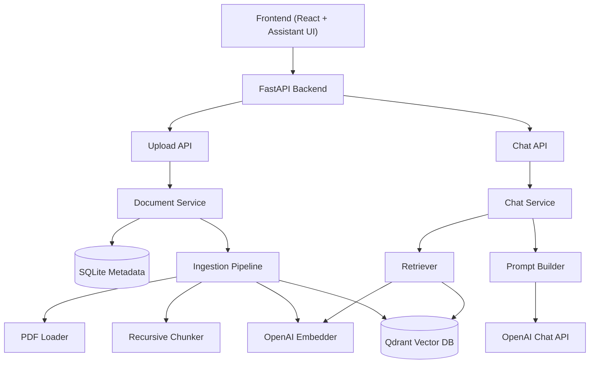
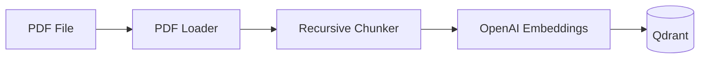
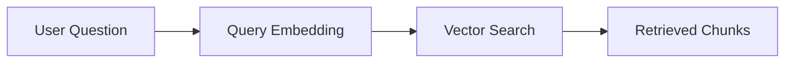
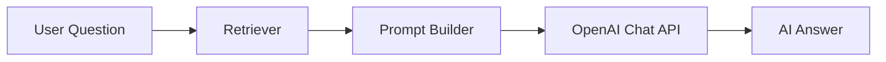

✅ Backend Foundation
FastAPI
Project Structure
Config
Logging
✅ Document Management
Upload PDF
File Storage
SQLite Metadata
Document Repository
✅ Ingestion Pipeline
PDF Loader
Recursive Chunking
OpenAI Embeddings
Qdrant Indexing
✅ Retrieval
Vector Search
Retriever
Prompt Builder
✅ Chat
Chat Service
OpenAI Integration
Chat API


## 🏗️ System Architecture


## 📄 Document Ingestion Pipeline



## 🔍 Retrieval Flow



## 💬 RAG Chat Flow



## 📁 Project Structure

```text
backend/
├── app/
│   ├── api/
│   ├── core/
│   ├── embedding/
│   ├── ingestion/
│   ├── models/
│   ├── retrieval/
│   ├── services/
│   └── storage/
│
├── tests/
└── pyproject.toml

frontend/
├── src/
├── public/
└── package.json
```


